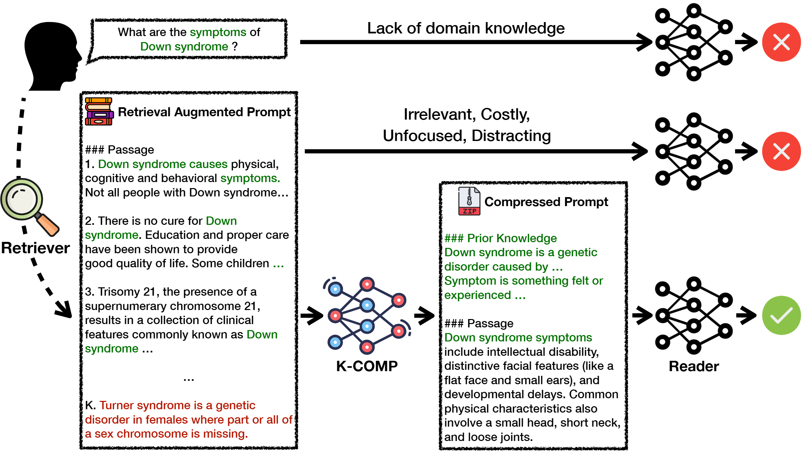

<h1 align="center">K-COMP: Retrieval-Augmented Medical Domain Question Answering With Knowledge-Injected Compressor</a></h2>


This is the official implementation of the following paper:

> **K-COMP: Retrieval-Augmented Medical Domain Question Answering With Knowledge-Injected Compressor** [[Paper](https://arxiv.org/abs/2501.13567)]

<p align="center"></p>
<p align="center">The overview of K-COMP.</p>

## Environment Setup
```
conda env create -f environment.yml
```

## Data Collection
Download the datasets:
* A Question-Entailment Approach to Question Answering (MedQuAD) [[gihub](https://github.com/abachaa/MedQuAD)]
* Question Answering with Long Multiple-Span Answers (MASH-QA) [[gihub](https://github.com/mingzhu0527/MASHQA)]
* BioASQ-QA: A manually curated corpus for Biomedical Question Answering (BioASQ) [[website](https://participants-area.bioasq.org/datasets/)]

Download the retrieval corpus:
* Benchmarking Retrieval-Augmented Generation for Medicine (MedCorp) [[github](https://github.com/Teddy-XiongGZ/MedRAG)]


## Data Processing
After correctly setting the configuration, such as the downloaded data and corpus path, run the scripts below sequentially.
```
cd script
bash 0_retrieval.sh
bash 1_data_process.sh
```
After data processing, dataset should contain `prompt` and `completion`.

## Train & Inference
```
bash 2_train.sh
bash 3_inference.sh
```

## Cite

```
@article{cho2025k,
  title={K-COMP: Retrieval-Augmented Medical Domain Question Answering With Knowledge-Injected Compressor},
  author={Cho, Jeonghun and Lee, Gary Geunbae},
  journal={arXiv preprint arXiv:2501.13567},
  year={2025}
}
```

## Acknowledgement
This repo is partially based upon the following repos:
* Unsupervised Dense Information Retrieval with Contrastive Learning [[github](https://github.com/facebookresearch/contrieve)]
* KILM: Knowledge Injection into Encoder-Decoder Language Models [[github](https://github.com/alexa/kilm)]
* TRL - Transformer Reinforcement Learning [[github](https://github.com/huggingface/trl)]

Thanks for their wonderful work.