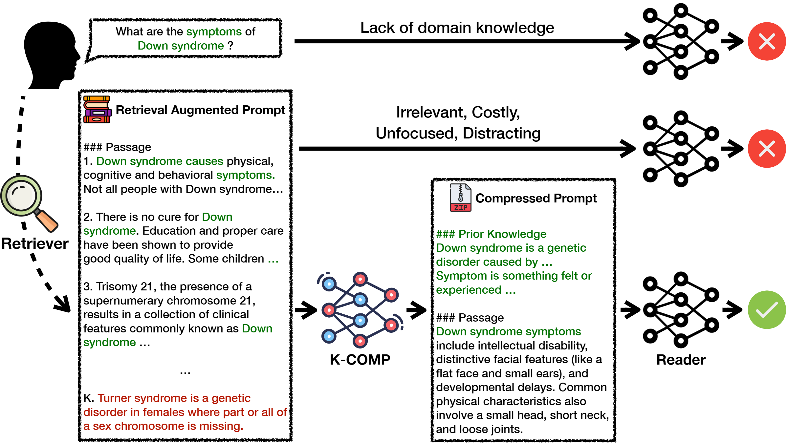

<h1 align="center">K-COMP: Retrieval-Augmented Medical Domain Question Answering With Knowledge-Injected Compressor</h1>

<p align="center">
  <a href="https://arxiv.org/abs/2501.13567"></a>
  <a href="https://huggingface.co/jeonghuncho/models"></a>
</p>

<p align="center"></p>
<p align="center"><i>Overview of the K-COMP framework.</i></p>

## Project Structure

```
K-COMP/
├── train.py                 # Model training script
├── inference.py             # Model inference script
├── src/                     # Core library modules
│   ├── data.py              # Dataset & collator for inference
│   ├── index.py             # FAISS indexer for passage retrieval
│   ├── normalize_text.py    # Unicode text normalization
│   ├── slurm.py             # Distributed / SLURM utilities
│   └── util.py              # Wikipedia XML processing utilities
├── retrieval/               # Passage retrieval pipeline
│   ├── generate_embeddings.py
│   └── retrieve_passages.py
├── data_processing/         # Data preprocessing pipeline
│   ├── extract_entity.py    # Step 1: Extract entities from questions
│   ├── generate_summary.py  # Step 2: Prepare GPT batch summary requests
│   ├── preprocess_wiki.py   # Step 3: Filter & process Wikipedia articles
│   ├── extract_short_desc.py# Step 4: Extract short descriptions from wiki dump
│   ├── tag_entities.py      # Step 5: Tag entities with descriptions
│   └── mask_questions.py    # Step 6: Apply question masking
├── scripts/                 # Shell scripts to run each stage
├── data/                    # Static data files
│   └── short_descriptions_med.json
└── assets/                  # Figures for documentation
```

## Setup

### Environment

```bash
# Option A: Conda (full environment)
conda env create -f environment.yml

# Option B: pip (recommended)
pip install -r requirements.txt
```

### Datasets

Download the QA datasets:
- [MedQuAD](https://github.com/abachaa/MedQuAD) — A Question-Entailment Approach to Question Answering
- [MASH-QA](https://github.com/mingzhu0527/MASHQA) — Question Answering with Long Multiple-Span Answers
- [BioASQ](https://participants-area.bioasq.org/datasets/) — Biomedical Question Answering

Download the retrieval corpus:
- [MedCorp](https://github.com/Teddy-XiongGZ/MedRAG) — Benchmarking Retrieval-Augmented Generation for Medicine

### Model Checkpoints

Pretrained checkpoints are available on [Hugging Face](https://huggingface.co/jeonghuncho/models).

## Usage

All scripts should be run from the **project root directory**.

### Step 0 — Passage Retrieval

```bash
bash scripts/run_retrieval.sh
```

### Step 1 — Data Processing

```bash
bash scripts/run_data_process.sh
```

> **Note:** Step 1-2 uses the [OpenAI Batch API](https://platform.openai.com/docs/guides/batch) to generate summaries with GPT-4o-mini. After the batch completes, include the `summary` field in your data. See [`data_processing/README.md`](data_processing/README.md) for details.

After data processing, each sample should contain `prompt` and `completion` fields.

### Step 2 — Training

```bash
bash scripts/run_train.sh
```

### Step 3 — Inference

```bash
bash scripts/run_inference.sh
```

## Citation

```bibtex
@misc{cho2025kcompretrievalaugmentedmedicaldomain,
      title={K-COMP: Retrieval-Augmented Medical Domain Question Answering With Knowledge-Injected Compressor}, 
      author={Jeonghun Cho and Gary Geunbae Lee},
      year={2025},
      eprint={2501.13567},
      archivePrefix={arXiv},
      primaryClass={cs.CL},
      url={https://arxiv.org/abs/2501.13567}, 
}
```

## Acknowledgement

This repository builds upon the following work:
- [Contriever](https://github.com/facebookresearch/contriever) — Unsupervised Dense Information Retrieval with Contrastive Learning
- [KILM](https://github.com/alexa/kilm) — Knowledge Injection into Encoder-Decoder Language Models
- [TRL](https://github.com/huggingface/trl) — Transformer Reinforcement Learning

## License

Please refer to the licenses of the respective base repositories.
